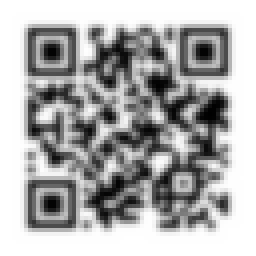
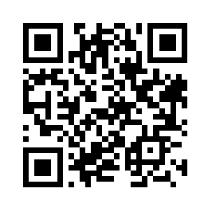

# QRGAN

## Abstract
  QRGAN is capable of generating realistic QR code image.  
  You can convert indistinct QR code image into distinct image.  
  
  
  &emsp;
  
  
## Dataset Preparation
 - qr_dataset : https://www.kaggle.com/coledie/qr-codes  
 
     recommendation   
     &emsp; image-size : 256x256 pixel  
     &emsp; number of images : 1000  
     &emsp; epoch : 1

